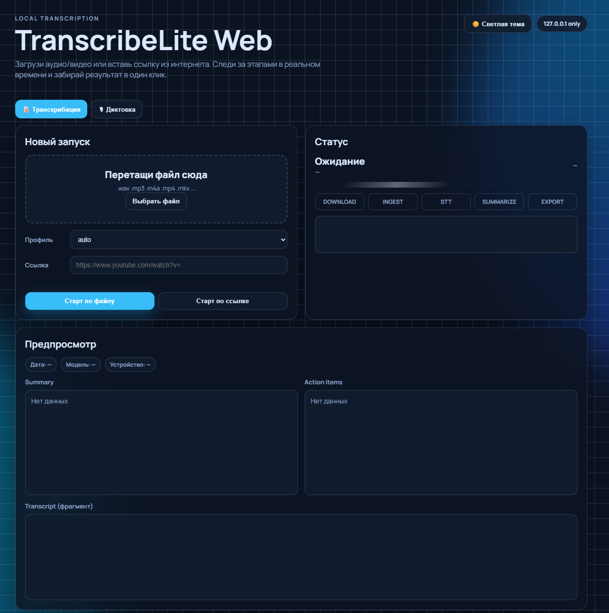

# TranscribeLite

Локальное приложение для Windows 10/11:

`аудио/видео -> транскрипт -> (опционально) локальное summary через Ollama -> экспорт`

## Скриншот



## Возможности

- CLI и Web интерфейс
- GPU-распознавание через `faster-whisper` (CUDA при наличии)
- Локальное summary только через Ollama (без облачных API)
- Профили качества: `auto`, `fast`, `balanced`, `quality`
- Запуск в online/offline/portable режимах
- В Web: загрузка файла или запуск по ссылке из интернета (например YouTube) через `yt-dlp`
- Q&A по записи: блок `🧠 Спроси у записи` (локально через Ollama + SQLite FTS5)
- История Q&A в веб-интерфейсе с сохранением между перезапусками
- Глобальный поиск по истории записей (`/api/search`)
- Real-time диктовка во второй вкладке `🎙 Диктовка` (локально через WebSocket)
- Глобальная hotkey-диктовка (режим B) без браузера: `scripts\run_hotkey.bat`
- Polish Text: `✨ Привести в порядок` во вкладке диктовки (Ollama-only)

## Структура проекта

```text
TranscribeLite/
├─ transcribelite/               # Основной Python-пакет
│  ├─ app.py                     # CLI entrypoint
│  ├─ web.py                     # FastAPI Web UI + API + WebSocket
│  ├─ config.py                  # config.ini: создание/чтение/дефолты
│  ├─ search_index.py            # SQLite FTS5 индекс и поиск
│  ├─ hotkey.py                  # Глобальная hotkey-диктовка (Mode B)
│  ├─ pipeline/
│  │  ├─ ingest.py               # ffmpeg -> wav 16k mono
│  │  ├─ stt_faster_whisper.py   # STT (GPU/CPU, faster-whisper)
│  │  ├─ summarize_ollama.py     # Локальный summary (Ollama)
│  │  └─ export.py               # Экспорт transcript/note/json
│  └─ utils/                     # paths/logging/http/chunking/helpers
├─ web/
│  ├─ index.html                 # UI (upload, QA, dictation, history)
│  └─ static/
│     ├─ app.js                  # Логика фронтенда
│     └─ style.css               # Стили (light/dark themes)
├─ prompts/                      # Шаблоны промптов и note
├─ scripts/                      # install/doctor/run/hotkey батники
├─ output/                       # Результаты обработки
├─ cache/                        # Временные файлы и dictation буферы
├─ models/                       # Локальные модели Whisper
├─ wheels/                       # Офлайн колёса для установки
├─ data/                         # index.db и история Q&A
├─ config.ini                    # Конфигурация проекта
├─ requirements.txt              # Основные зависимости
├─ requirements-lock.txt         # Полный freeze зависимостей
└─ README.md
```

## Параметры конфигурации

### Основные секции `config.ini`

| Секция | Ключевые параметры | Назначение |
|---|---|---|
| `[paths]` | `models_dir`, `cache_dir`, `output_dir`, `logs_dir`, `ffmpeg_path` | Пути и внешние бинарники |
| `[stt]` | `model_name`, `device`, `compute_type`, `beam_size`, `vad_filter`, `language` | Транскрибация через faster-whisper |
| `[profile]` | `active` | Активный профиль: `auto/fast/balanced/quality` |
| `[profile_auto]` | `short_max_minutes`, `medium_max_minutes`, `short_profile`, `medium_profile`, `long_profile` | Автовыбор профиля по длительности |
| `[summarize]` | `enabled`, `ollama_url`, `model`, `timeout_s`, `max_chars` | Локальное summary через Ollama |
| `[export]` | `save_txt`, `save_json`, `save_md`, `include_timestamps` | Формат и состав экспортируемых файлов |
| `[dictation]` | `hotkey`, `profile`, `language`, `summarize`, `auto_save` | Настройки вкладки диктовки и hotkey-режима |

### Профили STT

| Профиль | Скорость | Качество | Типичный сценарий |
|---|---|---|---|
| `fast` | Высокая | Базовое | Быстрые черновики, заметки, длинные файлы |
| `balanced` | Средняя | Хорошее | Универсальный режим для большинства задач |
| `quality` | Ниже | Максимальное | Важные звонки/интервью, сложная речь |
| `auto` | Адаптивно | Адаптивно | Автоподбор профиля по длительности записи |

## Быстрый старт (online)

1. Установите Python 3.11+.
2. Выполните `scripts\install_online.bat`.
3. Выполните `scripts\doctor.bat`.
4. Запустите CLI: `scripts\run.bat <файл_или_папка>`.
5. Запустите Web: `scripts\run_web.bat`, затем откройте `http://127.0.0.1:7860`.

## Быстрый старт (offline)

На ПК с интернетом:

1. Выполните `scripts\build_wheels.bat`.
2. Скопируйте весь проект вместе с папкой `wheels\`.

На офлайн ПК:

1. Установите Python 3.11+.
2. Выполните `scripts\install_offline.bat`.
3. Выполните `scripts\doctor.bat`.

## Web интерфейс

Запуск:

- `scripts\run_web.bat`

Поддерживает:

- загрузку медиафайла
- запуск по URL (`http/https`) через `yt-dlp`
- живой статус по этапам (`download -> ingest -> stt -> summarize -> export`)
- красивый предпросмотр: карточки `Summary` и `Action items`, плюс фрагмент транскрипта
- Q&A по текущей записи (`POST /api/ask`): ответ + источники (sources)
- История последних вопросов/ответов в UI
- Глобальный поиск по всем проиндексированным записям в UI
- Блоки Q&A и глобального поиска сворачиваемые (по умолчанию закрыты)
- Вкладка `🎙 Диктовка` с кнопками `Start / Stop / Clear / Save / Copy`
- Во вкладке диктовки есть Markdown Preview: табы `Исходник` / `Результат (MD)`
- История сохранённых диктовок в UI + API `GET /api/dictation/history`
- скачивание `note.md`, `transcript.txt`, `transcript.json`
- переключение светлой/тёмной темы (сохраняется в браузере)
- во вкладке `🎙 Диктовка` кнопка `✨ Привести в порядок`:
  - presets: `punct`, `clean`, `short`, `task`, `obsidian`, `custom`
  - строгий режим (`strict mode`)
  - выбор модели Ollama
  - автодозагрузка модели с индикатором статуса, если модель ещё не скачана
  - результат показывается в модалке и по кнопке `Вставить в Live text` заменяет текст диктовки
  - поле `Live text` редактируемое, можно вручную править перед сохранением

### Ask the recording (Q&A)

- После `job done` транскрипт автоматически индексируется в `data/index.db`.
- Индексация: SQLite FTS5, токенизатор `unicode61`, word-chunks с overlap.
- В UI задайте вопрос в блоке `🧠 Спроси у записи`, получите:
  - короткий ответ
  - `Sources` с фрагментами, на которых основан ответ
- Если релевантных источников нет, сервис вернёт: `В записи этого нет.`
- Если Ollama недоступна, UI покажет понятную ошибку.
- Для глобального поиска используйте endpoint: `GET /api/search?q=<запрос>&limit=12`.
- Для восстановления истории Q&A используйте endpoint: `GET /api/qa/history?limit=50`.

### Вкладка Диктовка (real-time)

- Работает локально через `WS /ws/dictation` (127.0.0.1).
- Браузер отправляет аудио чанками (`MediaRecorder`, 250-500ms).
- Поддерживаемые mimeType:
  - `audio/webm;codecs=opus`
  - `audio/ogg;codecs=opus`
- В процессе показывается живой текст (`partial/final`) и метрики (`RTF`).
- `Live text` форматируется в читабельный многострочный вид (не сплошной строкой).
- Markdown Preview рендерит текст как полноценный Markdown (заголовки, списки, чекбоксы, code-block, цитаты).
- По `Save` результат сохраняется в обычный `output/...` как стандартный job с файлами:
  - `transcript.txt`
  - `transcript.json`
  - `note.md`
- При сохранении используется текущий текст из `Live text` (включая ваши ручные правки/вставку после polish).
- Если Ollama недоступна, сохранение не падает: summary пропускается.
- По умолчанию при `Stop` включено автосохранение результата.

### Global Hotkey (Mode B)

- Запуск: `scripts\run_hotkey.bat`
- По умолчанию hotkey: `Ctrl+Alt+Space`
- Логика:
  - первое нажатие: старт записи микрофона
  - второе нажатие: стоп, транскрибация, экспорт в `output/...`
- Работает полностью локально, без браузера и без облаков.

### Polish Text (Ollama-only)

- Кнопка `✨ Привести в порядок` доступна только во вкладке диктовки.
- Источник для обработки: `Диктовка -> Live text` (текущий текст в поле live/final).
- Поле `Live text` редактируемое: можно править текст вручную до сохранения.
- После `Run` в модалке используйте кнопку `Вставить в Live text`, чтобы заменить надиктованный текст улучшенной версией.
- Отдельного блока `Polished text` нет: итоговый рабочий текст всегда в `Live text`.
- Если Ollama недоступна, UI покажет понятную ошибку, основной workflow не падает.

Настройки в `config.ini`:

```ini
[dictation]
hotkey = ctrl+alt+space
profile = fast
language = ru
summarize = true
max_seconds = 120
silence_stop = false
auto_save = true
```

Ограничения URL-режима:

- максимальная длительность: 3 часа
- максимальный размер скачивания: 1 GB
- только одиночный ролик (playlist отключён)

## Профили качества

В `config.ini`:

```ini
[profile]
active = auto

[profile_auto]
short_max_minutes = 0.5
medium_max_minutes = 6
short_profile = quality
medium_profile = balanced
long_profile = fast
```

Переопределение на один запуск:

- `--profile auto|fast|balanced|quality`

## CLI

- `python -m transcribelite.app transcribe <файл_или_папка>`
- `python -m transcribelite.app doctor`
- `python -m transcribelite.app config --init`
- `python -m transcribelite.app --version`

## Выходные файлы

Для каждого источника создаётся:

`output\<timestamp>_<name>\`

Файлы:

- `transcript.txt`
- `transcript.json`
- `note.md`

## Portable режим

1. Выполните `scripts\build_portable.bat`.
2. Перенесите `portable_dist\TranscribeLite-Portable\` на другой ПК.
3. Установите Ollama и модель (например `ollama pull llama3.1:8b`).
4. Запускайте `run_portable.bat <файл_или_папка>`.
5. Для проверки окружения используйте `doctor_portable.bat`.

## Важно

- Summary работает только локально через Ollama.
- Если Ollama недоступна, транскрипция не падает: summary пропускается.
- Для URL-источников используйте только контент, который вам разрешено обрабатывать.

## Версии

- Версия приложения: `transcribelite.__version__`
- История изменений: `CHANGELOG.md`
